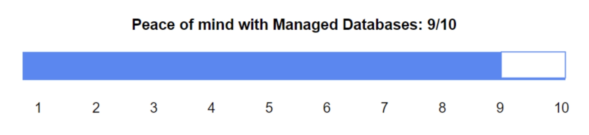

# ScraperAPI如何用托管数据库撑起每月360亿次抓取请求

---

做网络爬虫的都知道，数据库就是命根子。你的爬虫再快，数据库撑不住也白搭。ScraperAPI这家公司现在每月处理360亿次抓取请求,每秒爬14,000个网站——这是什么概念?相当于全球互联网流量的一个小型洪峰持续冲击你的服务器。

他们是怎么扛住的?答案很简单:别自己折腾数据库,找靠谱的托管服务。这篇文章讲的就是ScraperAPI从自建数据库的泥潭里爬出来的真实故事,以及为什么他们最终选择了DigitalOcean的托管数据库。

---

## 自己管数据库?那是上辈子的噩梦

ScraperAPI的CTO Zoltan Bettenbuk在加入公司之前,干过一件他发誓再也不想干的事:自己管数据库。

他的原话是这么说的:"自己管数据库的压力大到难以想象。你要确保公司最值钱的资产——数据——永远安全、永远在线、有备份、能故障转移。说实话,我再也不想干这活儿了。"

这不是矫情。想象一下:你半夜两点被电话吵醒,数据库崩了;周末你在陪家人,突然要处理安全补丁;平时还得盯着各种漏洞公告,生怕哪天被黑客盯上。这种日子,谁爱过谁过去。

在他之前的工作中,用的是裸机服务器。扩容一次数据库?等两周——因为服务商得先采购硬件。这种速度在互联网行业基本等于自杀。所以当他来到ScraperAPI时,第一件事就是:找个靠谱的云数据库服务。

## 一分钟扩容 vs 两周等待:云端的魔法

ScraperAPI现在用的是DigitalOcean的托管PostgreSQL和Redis。这俩数据库撑起了他们整个业务架构。

最让Zoltan满意的是什么?扩容速度。

"如果我想把数据库性能扩大一倍,一分钟就能搞定。"他说这话时,语气里带着一种"终于不用再受那份罪"的轻松感。

这不是吹牛。你去DigitalOcean控制台点几下鼠标,调整计算资源和存储空间,等一分钟——搞定。不需要填工单,不需要等技术支持回复,更不需要等两周让人去机房插硬盘。

对于一个每月处理360亿次请求的服务来说,这种灵活性就是生命线。流量突然暴增?一分钟扩容。业务淡季想省钱?缩减配置同样快。👉 [想了解ScraperAPI如何用托管数据库实现灵活扩展?](https://www.scraperapi.com/?fp_ref=coupons)

## 五个工程师管理全球基础设施:小团队的生存之道

这里有个更疯狂的数字:ScraperAPI全公司只有12个人,其中5个负责云基础设施。

想想他们的竞争对手——那些动辄几百人技术团队的大公司。ScraperAPI用五分之一甚至更少的人力,撑起了同等规模的业务。秘诀在哪?

别自己造轮子。

托管数据库自动处理了这些事:
- **自动备份**:不用半夜起来手动备份,也不用担心备份脚本写错
- **自动更新**:新版本、热修复、安全补丁全自动搞定
- **自动故障转移**:主库挂了?备库自动顶上,你甚至可能都不知道出过问题

Zoltan特别强调了自动更新这件事:"最宝贵的地方在于安全性。我们不需要操心版本更新、补丁和修复。这些事如果自己干,至少需要一个全职员工——不光要每天应用这些更改,还得持续监控漏洞。这太折磨人了。"

一个全职DBA的年薪是多少?在美国大概10-15万美元。ScraperAPI省下的不只是这笔钱,更重要的是工程师可以把时间花在真正创造价值的地方:改进爬虫算法、优化代理网络、服务客户。

## 成本:DigitalOcean vs AWS的残酷对比

ScraperAPI是个网络密集型应用。他们每月消耗1PB(1000TB)的出站带宽,入站流量也差不多。

这种流量规模在AWS上跑?账单会把人吓死。

Zoltan算了笔账:"在AWS上运行ScraperAPI的成本,会比DigitalOcean高250%。"

换句话说,如果他们在DigitalOcean上每月花1万美元,在AWS上就得花3.5万。这还只是基础设施成本,没算数据库托管服务的价格差异。

对于一个追求精益运营的创业公司来说,这种成本差异是致命的。省下来的钱可以用来雇更多工程师、做更多营销、给客户更好的价格——这是良性循环的起点。

## 从两个人到12个人:增长背后的基础设施选择

ScraperAPI成立于2018年。当Zoltan加入时,公司只有2个人。现在他们有12名员工,服务超过1万家公司客户,年营收增长30-35%。

这种增长速度靠什么支撑?核心之一就是技术栈的可扩展性。

如果他们当初选择了自建数据库,现在团队规模可能要翻倍——多出来的人全在忙运维。或者更糟糕的情况:数据库成为瓶颈,业务增长被迫放缓,客户体验变差,口碑受损。

但因为选对了工具,ScraperAPI可以保持小而美的团队结构,同时承载巨量的业务规模。这就是"用钱买时间"的最佳实践:把基础设施交给专业团队(DigitalOcean),让自己的工程师专注于核心竞争力(爬虫技术)。

## 企业客户在招手:下一阶段的野心

现在ScraperAPI正在追逐企业客户——那些有结构化数据需求的大公司。

这种客户对稳定性和数据安全的要求更高。想象一下一家财富500强公司的采购经理在评估供应商:"你们的数据库谁管?自己管的?那故障SLA是多少?备份策略是什么?灾难恢复计划呢?"

如果回答是"我们用DigitalOcean托管数据库,99.99%可用性SLA,自动备份和故障转移",对方会点头。如果回答是"我们自己管,有个小伙子负责",对方会微笑着把你的名片扔进垃圾桶。

托管数据库不只是技术选择,更是商业信誉的一部分。

## 真相就是这么简单

回到最开始的问题:ScraperAPI是怎么用12个人撑起每月360亿次抓取请求的?

答案没那么复杂:
1. 别在非核心业务上浪费时间(比如管数据库)
2. 选择能快速扩展的基础设施(托管服务)
3. 控制好成本(DigitalOcean比AWS便宜250%)
4. 让工程师做他们最擅长的事(写代码,而不是修数据库)

Zoltan的总结特别到位:"从一开始就选择托管数据库,是我们做对的决定之一。"

如果你也在做数据密集型业务——不管是爬虫、数据分析、SaaS还是其他——自己管数据库基本等于给自己找罪受。把这活儿交给专业的,👉 [了解ScraperAPI如何用托管数据库实现业务爆发式增长](https://www.scraperapi.com/?fp_ref=coupons),你会发现世界突然清净了很多。

---

数据库是你业务的命脉,但管理它们的开销大到难以想象——无论你用的是PostgreSQL、MySQL、Redis还是MongoDB。托管数据库服务能帮你卸掉那些必要但耗时的管理任务:部署、备份、故障转移、更新等等全自动搞定,让你把精力放在真正重要的地方——打造优秀的产品。ScraperAPI的故事证明,选对工具能让小团队干出大事业,这就是托管数据库的价值所在。
